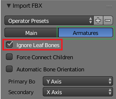
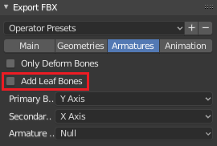

# "Ignore leaf bones" extra reading

StackOverflow user Leander, June 3 2018: [(post)](https://blender.stackexchange.com/questions/109972/fbx-export-bone-end) (YMMV)

> In many other software packages (e.g. maya) and in the fbx format there are joints instead of bones. A joint (point position) has a location, orientation, size but no length. Blender's bones naturally have a length since they actually are two connected joints. In reality you don't really need the tip of the bone to create a transformation matrix, but this is a Blender specific design decision.  So when exporting, an unconnected bone is converted into two connected joints. Two bones joints are converted to three connected joints. That way and end joint is automatically created to preserve the tip information of a bone. Even when rigging with joints it is common to create an end joint, since it makes orienting the last joint (before the end) easier.  Importing the rig create a bone for every joint, because the importer doesn't know if the rig uses end joints or not.  When importing a rig into Blender, there is an option to automatically remove the end joints: ignore leaf bones    In the process of animation, the leaf/end/tip joints (bones) are usually irrelevant and can be ignored or deleted.  To enable/disable the export of leaf bones, check/uncheck the option in the export options under Armatures.  
