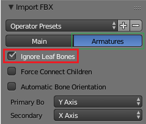
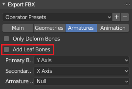
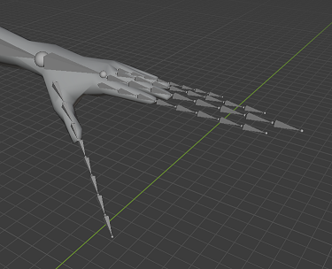
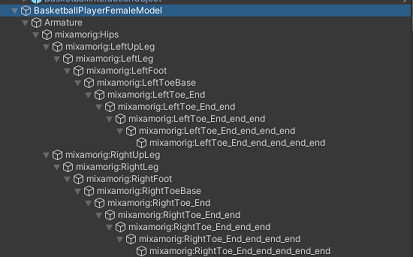

# Blender import and export (todo)

## "Ignore leaf bones"

When importing to Blender, check "Ignore leaf bones." When exporting, uncheck "Add Leaf Bones."

Like this:

Otherwise, the export will include extra bones (you'll notice they go by an "_end" naming scheme). Over the course of many imports and exports, those really add up:

[Here's](blender-ignore-leaf-bones) a detailed explanation if you want!

---